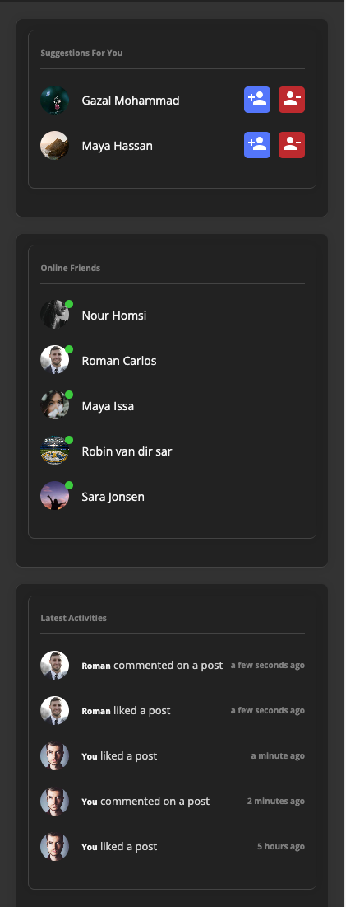
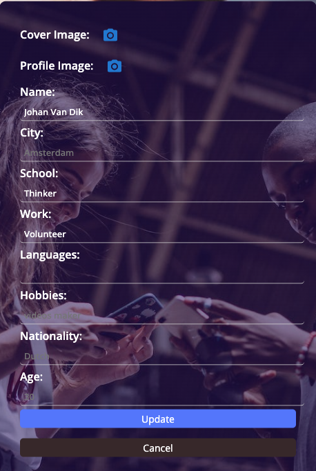

# InterActify - Social Media App

InterActify is a social media platform inspired by popular social networks. It allows users to connect with friends, share updates, and engage with posts in a familiar interface.

# Features

- User Registration and Authentication: Users can sign up and log in to their accounts securely.
- User Profiles: Each user has a profile with customizable avatars and personal information.
- News Feed: Users see a personalized news feed with posts from friends they follow.
- Location Tagging: Users can tag their posts with locations to share their whereabouts.
- Friend Tagging: Tag friends in posts and comments to notify and involve them.
- Stories: Users can share ephemeral stories that disappear after a certain period.
- Photo Sharing: Upload and share photos with friends and followers.
- Following and Followers: Users can follow/unfollow other users to see their posts.
- Likes and Comments: Interact with posts by liking and leaving comments.
- Real-time Updates: Get notified of new comments, likes, and friend requests.
- Responsive Design: User-friendly interface that works well on various devices.

## Getting Started

1. Sign up for an InterActify account to get started.
2. Explore the news feed to see posts from friends and people you follow.
3. Create your own posts, upload photos, and share your stories.
4. Interact with posts by liking, commenting, and tagging friends.
5. Discover new friends by searching for users and sending friend requests.

## Screenshots

